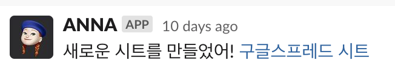

# AUSG Notoriously Nerdy Assistant



# 기본적인 개발환경 구축하기

```sh
make setup_local_env
```

# 실제 AUSG 슬랙과 로컬의 안나를 연동해서 테스트하기

1. 안나 깨우기

```sh
python3 src/anna.py
# INFO:slack_bolt.App:⚡️ Bolt app is running! 라는 메시지가 보이면 성공적으로 깨운 것이다.

LOCAL=True python3 src/anna.py # LOCAL 환경변수를 활성화하면서 실행하기. (활용 예시: https://github.com/AUSG/anna-v2/blob/main/src/configuration/log_configuration.py)
```

2. 로컬에서 슬랙 이벤트 수신할 수 있도록 세팅

슬랙에선 따로 개발을 위한 테스트 콜백을 제공하지 않는다. 따라서 슬랙의 **실제** 이벤트를 로컬에서 수신받아서 검증해야된다. ~~super dog fooding~~

외부에서 내 로컬 컴퓨터로 요청을 쏠 수 있게 도와주는 도구가 많은데, 여기선 `ngrok` 예시를 들겠다.

> 아래 이어지는 내용에선 ngrok 을 예시로 드는데, 왜인지 모르겠지만 이걸 쓰면 슬랙 이벤트를 정상적으로 받지 못한다. localtunnel 을 썼을 땐 연결은 잘 되었으나 자주 끊어지는 듯한 모습을 보였다. 다른 좋은 툴이 필요함.

```sh
brew install ngrok # 설치
ngrok http 8080 # 8080 포트 오픈
```

위 명령어 이후 나타나는 콘솔 화면에서 `Forwarding` 항목의 'xxx.ngrok.io'를 기억하자.

이후, [슬랙의 ANNA 설정 화면](https://api.slack.com/apps/AR4RK9XGX/event-subscriptions)에서 `Request URL` 항목을 위에서 언급한 포워딩 URL 로 바꿔준다. 정확한 path 는 다음과 같다:

```text
만약 ngrok 에 나온 URL이 https://bee1-122-42-248-160.jp.ngrok.io 이라면,
https://bee1-122-42-248-160.jp.ngrok.io/slack/events 을 입력해야 한다.
```

이 때 Step 4에서 안나를 미리 깨워두지 않았으면 에러 메시지가 나타날 것이다. 이는 url 을 바꿀 때 슬랙 측에서 정상적으로 이벤트 수신이 되는지 'challenge' 콜을 날리기 때문. 안나 콘솔과 ngrok 콘솔에서 관련 로그들을 확인할 수 있을 것이다.

반면에 성공적으로 "Verified" 메시지가 떴다면, 하단의 "Save Changes" 를 눌러 적용해주자.

3. 뒷정리 (URL 원복)

Step 5에서 세팅한 로컬 URL 을 다시 fly.io 서버의 것\*으로 바꿔두자. 현재는 아래 값이다.

```text
https://small-frost-842.fly.dev/slack/events
```

\* _로컬에 [flyctl](https://fly.io/docs/hands-on/install-flyctl/)이 설치되어있고 로그인이 되어있다면 서버 주소도 정확히 알 수 있긴 하다._

# 배포 방법

새 커밋이 `main` 브랜치에 추가되면 자동으로 배포된다 (ex. PR merge)

자세한 내용은 [./HOW_TO_DEPLOY.md]를 참고

# Misc

## 유용한 참고문서

이벤트 콜백 data 스펙: https://api.slack.com/apis/connections/events-api#the-events-api__receiving-events__callback-field-overview
