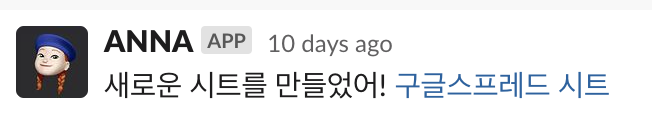

# AUSG Notoriously Nerdy Assistant



# 특수 커맨드

1. 새로운 빅챗 시트 만들기

```sh
@ANNA 새로운 빅챗 $SHEET_NAME
# 예시:
#   @ANNA 새로운 빅챗 빅챗 24-05-05
#   => 빅챗 24-05-05 라는 시트 생성
```

스레드에 위와 같이 입력하면 [구글 스프레드 시트](https://docs.google.com/spreadsheets/d/1FtKRO4gmlVg-Si0_CHt-tkpVd3LDTXdsoZ0u98MYd0k)에 $SHEET_NAME 이름으로 시트가 생성된다.

이렇게 시트가 생성된 이후엔, 해당 스레드의 첫 글에 :gogo: 이모지를 달아서 각자의 이름을 해당 시트에 추가할 수 있다.

# 기본적인 개발환경 구축하기

```sh
poetry shell
make setup_local_env
# virtual env sub-shell 접속
poetry install --with ci
```

이후의 명령어들은 모두 poetry 를 통해 의존성을 설치했다는 가정으로 설명한다.

# 실제 AUSG 슬랙과 로컬의 안나를 연동해서 테스트하기

1. 안나 깨우기

```sh
make wakeup_anna
```

2. 로컬에서 슬랙 이벤트를 수신할 수 있도록 포트 개방

슬랙에선 따로 개발을 위한 테스트 콜백을 제공하지 않는다. 따라서 슬랙의 **실제** 이벤트를 로컬에서 수신받아서 검증해야된다. ~~super dog fooding~~ 이 작업 도중엔 슬랙에서 안나가 졸게 되므로 (작동하지 않으므로) 미리 슬랙에서 다른 분들에게 공지해두는게 좋다.

외부에서 내 로컬 컴퓨터로 요청을 쏠 수 있게 도와주는 도구가 많은데, 여기선 `tunnelmole` 을 사용한다.

> 왜인지는 모르겠지만, ngrok 을 쓰면 슬랙의 검증 API 가 정상적으로 들어오지 않는다.

```sh
# 별도의 shell 에서 진행
make open_port
```

> 💡 아래 작업을 하기 전 미리 경고: URL 값을 바꾸기 전 기존 값을 따로 저장해 둘 것.

이후, [슬랙 - ANNA 설정](https://api.slack.com/apps/AR4RK9XGX/event-subscriptions)에서 `Request URL` 항목을 위 명령어 결과로 나온 https 주소로 바꿔준다. 그냥 URL 만 입력하면 안되고, `/slack/events`를 붙여줘야 한다[^1]. 성공적으로 "Verified" 메시지가 떴다면, 하단의 "Save Changes" 를 눌러 적용해주자.

[^1]: 예를 들어 포워딩 URL이 https://a.b.dev 라면, https://a.b.dev/slack/events 을 입력해야 한다.

3. 뒷정리 (URL 원복)

로컬 테스트가 끝났다면 위에서 세팅한 로컬 URL을 기존 값으로 바꿔두자. 현재는 `https://anna-v2-2023.fly.dev/slack/events` 이다.

# 배포 방법

see [HOW_TO_DEPLOY.md](.meta/docs/HOW_TO_DEPLOY.md).

# Misc

## .meta 디렉토리

실제 소스코드와 관련성이 적은 파일들은 [.meta](.meta) 디렉토리를 참고해주세요. 관련한 아이디어는 https://news.hada.io/topic?id=9504 를 보시면 됩니다.

## 참고자료

이벤트 콜백 data 스펙: https://api.slack.com/apis/connections/events-api#the-events-api__receiving-events__callback-field-overview
