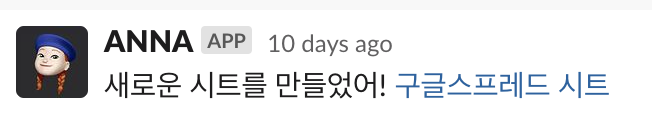

# AUSG Notoriously Nerdy Assistant



## 멘션 명령어

안나를 멘션해서 쓴다. `help` 로 아래 목록을 슬랙에서도 볼 수 있다.

| 명령 | 하는 일 |
| --- | --- |
| `새로운 빅챗 <이름> yy-MM-DD HH:mm~HH:mm` | 빅챗 신청 시트를 만든다 |
| `빅챗 리마인더 테스트 @받을사람` | 리마인더 DM 을 지금 그 사람에게만 보내본다 |
| `빅챗 리마인더 지금 전원 발송` | 내일 빅챗 신청자 전원에게 리마인더 DM 을 지금 보낸다 |
| `새로운 이슈 <제목>` | 안나 레포(AUSG/anna-v2)에 깃허브 이슈를 만든다 |
| `shuffle` 또는 `섞어줘` | 같이 멘션된 사람들을 섞어준다 |
| `help` 또는 `도움` | 도움말 |
| 그 외 아무 말 | 질문으로 보고 답한다 (`q)` 를 붙이면 위 명령어보다 우선) |

이미 올린 메시지를 **수정해도 명령이 다시 실행되지는 않는다.**

멘션과 별개로, 지정 채널(현재 `fun-anna-house`)에 올라온 새 글에는 김수빈 말투로 자동 답글을 단다. 글에 `안나x` 를 넣으면 그 글에는 반응하지 않는다.

## 빅챗

### 1. 시트 만들기

```sh
@ANNA 새로운 빅챗 AI 밋업 26-08-20 19:00~21:00
# => "AI 밋업 26-08-20 19:00~21:00" 시트 생성
```

시트 이름이 곧 이벤트 정보다. `<이름> yy-MM-DD HH:mm~HH:mm` 형식이어야 하고, 실제 존재하는 날짜/시각에 종료가 시작보다 늦어야 한다. 이 형식이라야 캘린더 버튼과 리마인더가 동작한다.

메시지를 직접 치는 대신, 빅챗 소개글의 더보기 메뉴(`⋮`) > `새로운 빅챗 만들기` 로 폼(모달)을 띄워 만들 수도 있다. 스레드 안의 답글에서 실행해도 스레드 첫 글 기준으로 동작한다.

만들어진 시트는 [구글 스프레드시트](https://docs.google.com/spreadsheets/d/1FtKRO4gmlVg-Si0_CHt-tkpVd3LDTXdsoZ0u98MYd0k)에 추가되고, 그 링크가 달린 답글이 스레드에 올라간다. 이 답글의 링크가 아래 참여 흐름의 앵커다.

### 2. 참여 신청

모집글(스레드 첫 글)에 :gogo: 이모지를 달면 시트에 등록된다. 이모지를 떼면 등록이 취소된다.

- 등록되면 본인에게만 보이는 안내와 함께 **Google Calendar 추가 / .ics 다운로드** 버튼이 뜬다.
- 시트가 만들어지기 **전에** 이모지를 눌러둔 사람도 시트 생성 직후 자동으로 일괄 등록된다.

### 3. 전날 리마인더 DM

매일 저녁 6시(KST)에 다음 날 열리는 빅챗 시트를 찾아, 신청자 전원에게 DM 을 보낸다. 신청 시트의 이메일을 멤버 시트와 대조해 슬랙 계정을 찾는 방식이다.

6시까지 기다리지 않고 지금 돌리려면 위 표의 `빅챗 리마인더 …` 두 명령을 쓴다. 둘 다 "지금 기준 내일" 열리는 빅챗을 실제 발송과 똑같이 찾고, 다른 건 받는 사람뿐이다. 신청자 수와 슬랙 계정 매칭 결과를 함께 알려주므로 발송이 안 될 때 시트 이름 문제인지 이메일 매칭 문제인지 구분할 수 있다.

안전장치가 서로 반대 방향이다. 전원 발송은 되돌릴 수 없어서 `지금 전원 발송` 문구를 통째로 쳐야 실행되고, 테스트는 대상을 멘션하지 않으면 아무것도 보내지 않는다.

## 깃허브 이슈 만들기

슬랙에서 "이거 버그 같은데" 하고 흘러가버리는 이야기를, 그 자리에서 안나 레포의 이슈로 남긴다.

```sh
@ANNA 새로운 이슈 빅챗 리마인더가 두 번 와요
# => AUSG/anna-v2 에 이슈를 만들고, 그 링크를 스레드에 답글로 알려준다
```

`새로운 이슈` 외에 `이슈 만들어줘` / `이슈 등록해줘` / `이슈 파줘` 로도 부를 수 있다.

- **제목**: 명령 뒤의 첫 줄. 너무 길면 120자에서 자른다.
- **본문**: 둘째 줄부터 쓴 내용.
- **스레드 맥락**: 스레드 안에서 부르면 그 스레드 대화가 본문에 인용으로 함께 들어간다 (최근 3000자까지).
- **출처**: 본문 끝에 요청한 사람과 원문 permalink 가 붙어서, 이슈만 보고 슬랙 대화를 찾아갈 수 있다.

제목 없이 부르거나 실패했을 때의 안내는 요청한 사람에게만 보인다. 이슈가 만들어졌을 때만 스레드에 공개로 답글을 단다.

`GITHUB_TOKEN` 이 비어 있으면 이 명령은 동작하지 않고 그 사실만 알려준다. 토큰은 대상 레포에 대해 `Issues: Read and write` 권한만 있으면 되고(fine-grained PAT 기준), 대상 레포는 `GITHUB_REPO` 로 바꿀 수 있다 (기본값 `AUSG/anna-v2`).

## 슬랙 앱 설정

[슬랙 앱 설정](https://api.slack.com/apps/AR4RK9XGX)에서 아래가 켜져 있어야 한다. 스코프를 추가했다면 워크스페이스에 재설치해야 적용된다.

| 설정 | 왜 |
| --- | --- |
| App Home > Show Tabs > **Messages Tab** | 꺼져 있으면 리마인더 DM 이 `messages_tab_disabled` 로 실패한다 |
| Interactivity & Shortcuts > Interactivity **ON** | 모달/버튼 상호작용 |
| 〃 Request URL = `https://anna-v2-2023.fly.dev/slack/events` | 이벤트 구독과 **같은** 주소. 서버 라우트가 이것 하나뿐이고 Bolt 가 payload 종류를 구분해 처리한다 |
| 〃 Shortcuts 에 "On messages" 타입 Callback ID `create_bigchat` | `새로운 빅챗 만들기` 단축메뉴 |
| OAuth & Permissions > Bot Token Scopes 에 `commands` | 〃 |

## 개발환경 구축

```sh
poetry shell
make setup_local_env
# virtual env sub-shell 접속
poetry install --with ci
```

이후의 명령어들은 모두 poetry 로 의존성을 설치했다는 가정으로 설명한다. 테스트와 린트는 `make ci` 로 한 번에 돌린다.

로컬에서 켜고 끌 만한 환경변수:

| 변수 | 기본값 | 설명 |
| --- | --- | --- |
| `BIGCHAT_REMINDER_ENABLED` | `true` | 리마인더 스케줄러. 로컬 인스턴스가 프로덕션과 같은 시크릿으로 뜨면 중복 발송되므로 끌 수 있다 |
| `ICS_TOKEN_SECRET` | 빈 값 | 비어 있으면 `.ics` 다운로드 버튼과 엔드포인트가 비활성화된다 |
| `GITHUB_TOKEN` | 빈 값 | 비어 있으면 이슈 생성 명령이 비활성화된다 |
| `GITHUB_REPO` | `AUSG/anna-v2` | 이슈를 만들 레포. 로컬 테스트 땐 개인 레포로 바꿔두면 안전하다 |
| `LOGLEVEL` | `DEBUG` | |

나머지 값(슬랙 토큰, GCP 키 등)은 [anna-v2-secret](https://github.com/AUSG/anna-v2-secret) 레포지토리에서 서브모듈로 받아온다.

## 실제 AUSG 슬랙과 로컬 안나를 연동해서 테스트하기

슬랙은 개발용 테스트 콜백을 따로 제공하지 않는다. 따라서 **실제** 이벤트를 로컬로 받아서 검증해야 한다. ~~super dog fooding~~ 이 작업 도중엔 슬랙의 안나가 졸게 되므로(작동하지 않으므로) 미리 공지해두는 게 좋다.

1. 안나 깨우기

```sh
make wakeup_anna
```

2. 로컬 포트 개방 — 외부에서 내 컴퓨터로 요청을 쏠 수 있게 해주는 도구로, 여기선 `tunnelmole` 을 쓴다.

```sh
# 별도의 shell 에서 진행
make open_port
```

> 왜인지는 모르겠지만, ngrok 을 쓰면 슬랙의 검증 API 가 정상적으로 들어오지 않는다.

3. 슬랙 앱 설정의 Request URL 을 위 명령어가 뱉은 https 주소로 바꾼다.

> 💡 **바꾸기 전에 기존 값을 따로 저장해 둘 것.**

[Event Subscriptions](https://api.slack.com/apps/AR4RK9XGX/event-subscriptions) 의 `Request URL` 에 주소를 넣되, 그냥 URL 만 넣으면 안 되고 `/slack/events` 를 붙여야 한다[^1]. "Verified" 가 뜨면 하단 "Save Changes". 모달/버튼까지 테스트하려면 Interactivity & Shortcuts 의 `Request URL` 도 같은 주소로 바꾼다.

[^1]: 예를 들어 포워딩 URL 이 https://a.b.dev 라면, https://a.b.dev/slack/events 을 입력해야 한다.

4. 뒷정리 — 끝났으면 URL 을 원래 값(`https://anna-v2-2023.fly.dev/slack/events`)으로 되돌린다.

## 배포

see [HOW_TO_DEPLOY.md](.meta/docs/HOW_TO_DEPLOY.md).

## Misc

### .meta 디렉토리

실제 소스코드와 관련성이 적은 파일들은 [.meta](.meta) 디렉토리를 참고해주세요. 관련한 아이디어는 https://news.hada.io/topic?id=9504 를 보시면 됩니다.

### 참고자료

이벤트 콜백 data 스펙: https://api.slack.com/apis/connections/events-api#the-events-api__receiving-events__callback-field-overview
